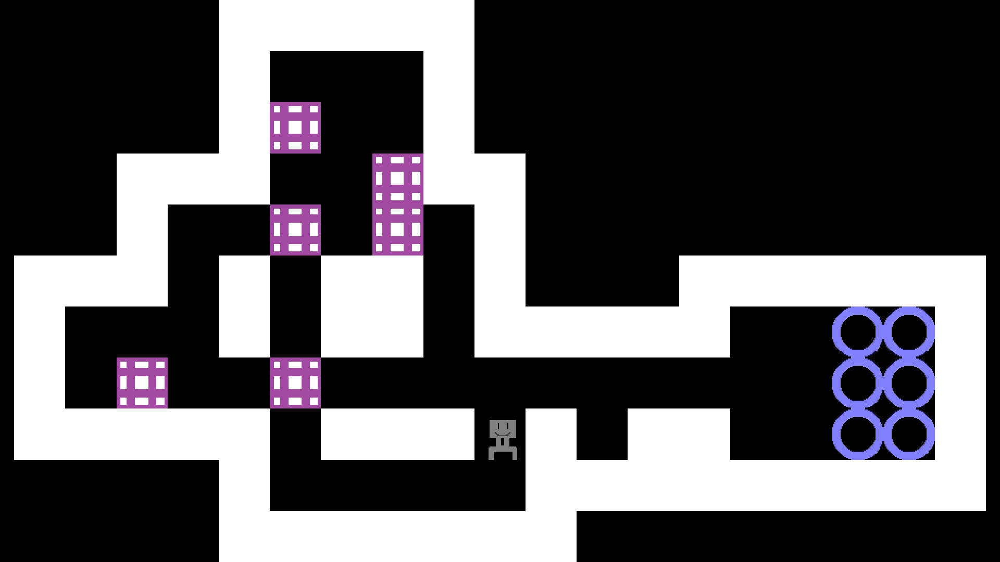
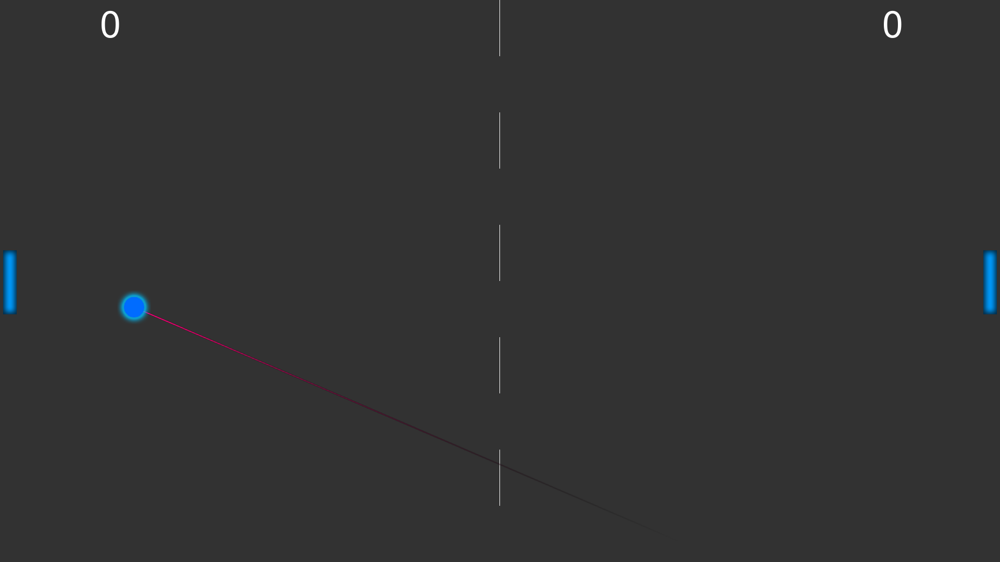
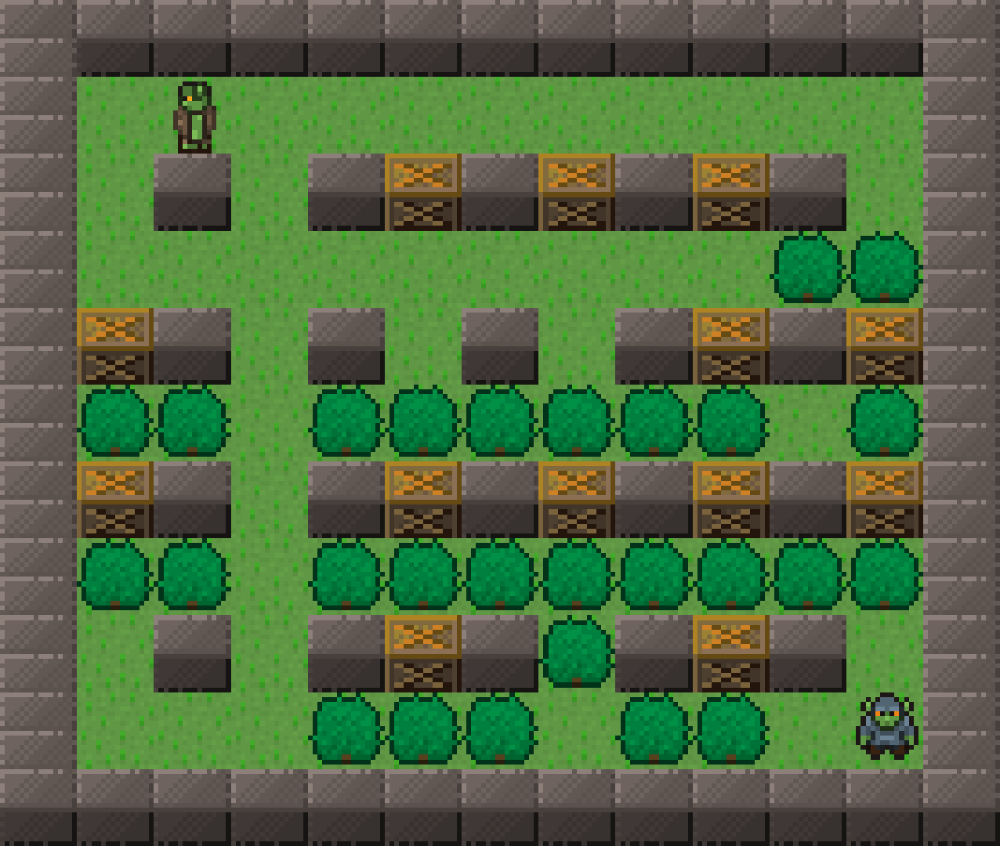
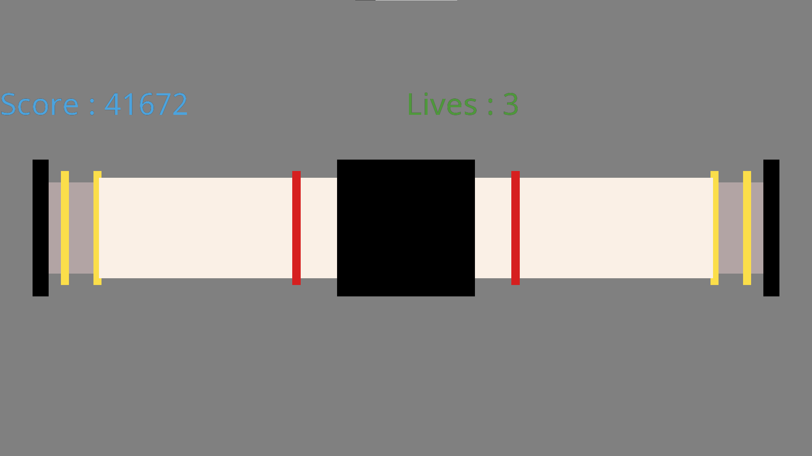

# ObEngineExamples
A set of game examples made with [ÖbEngine](https://github.com/Sygmei/ObEngine) !

## [ Sokoban](./Sokoban) by PierrickLP (MIT License)

## [ Pong](./Pong) by Sygmei (MIT License)

## [ Bomberman](./Bomberman) by Sygmei (MIT License)

## [ Gauge](./Gauge) by PierrickLP (MIT License)
